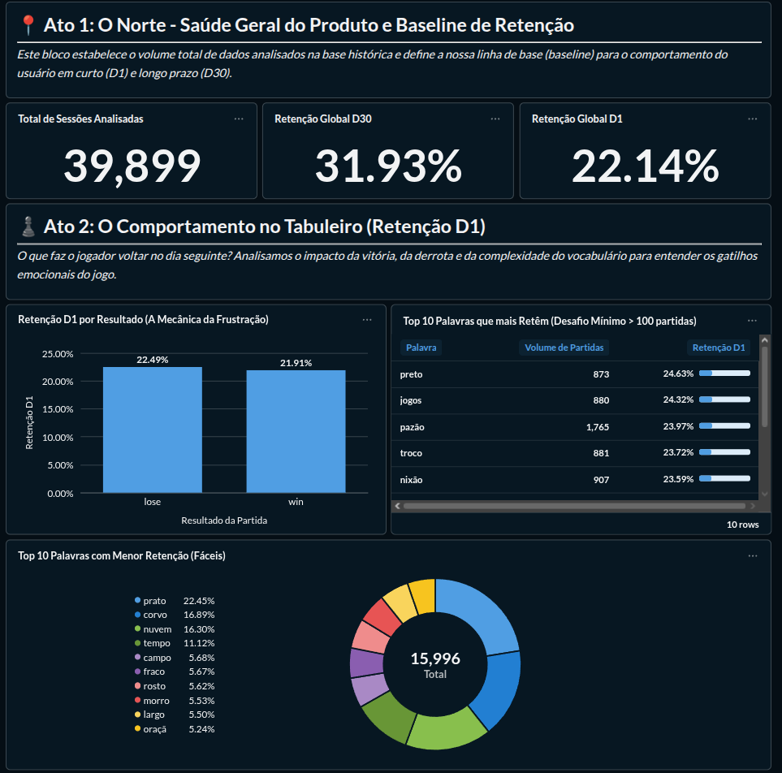
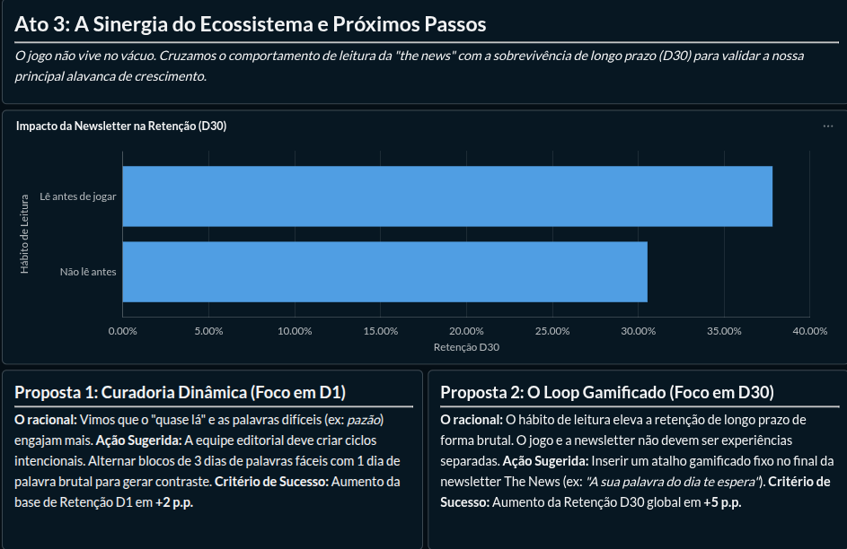

# Case Técnico — Retenção no Palavritas | the news

> **Analista de Dados (Produto & Growth)** — Este repositório documenta uma investigação sobre o que faz usuários voltarem a jogar o **Palavritas**, o jogo de palavras diário da newsletter **the news**. O foco não é código: é entender comportamento, encontrar alavancas reais de retenção e transformar insights em ações para o time de Produto.

---

## O que o case pede

Este case avalia cinco critérios, e cada entrega deste repositório responde diretamente a um deles:

| Critério | O que é avaliado | Onde está a resposta |
|---|---|---|
| **Limpeza** | Identificou e tratou os problemas antes de analisar? Documentou as decisões? | `notebooks/01_limpeza_e_diagnostico.ipynb` + seção abaixo |
| **Raciocínio analítico** | Foi além do óbvio? Questionou a pergunta antes de responder? | `notebooks/02_analise_e_cruzamentos.ipynb` + seção de achados |
| **Comunicação** | O documento pode ser lido pelo Head de Produto sem jargão técnico? | Este README + Dashboard executivo |
| **Propositivo** | Chegou em uma recomendação com hipótese e critério de sucesso? | Propostas 1 e 2 abaixo |
| **Profundidade** | Explorou múltiplas variáveis ou ficou só na superfície? | +10 variáveis testadas, validação estatística com Qui-Quadrado |

---

## O problema de negócio

Todo dia, milhares de leitores abrem a newsletter e encaram uma palavra. Alguns voltam no dia seguinte. Outros somem depois da primeira partida. A pergunta central deste case é simples — e difícil:

**O que determina se alguém continua jogando?**

Para responder, trabalhamos com duas métricas de retenção:

| Métrica | Campo | O que mede |
|---|---|---|
| **D1** | `played_next_day` | O usuário voltou a jogar no dia seguinte? |
| **D30** | `active_d30` | O usuário permaneceu ativo 30 dias após aquela sessão? |

---

## Fontes de dados

| Arquivo | Conteúdo | Volume |
|---|---|---|
| `palavritas_sessions.csv` | Logs de cada partida jogada | ~41 mil linhas |
| `palavritas_attempts.csv` | Logs de cada chute dentro da partida | ~147 mil linhas |
| `user_profile.csv` | Respostas de pesquisa de perfil (amostra) | ~800 usuários |

Os arquivos brutos estão em `data/raw/` e **não devem ser alterados**. Toda transformação gera versões documentadas em `data/processed/`.

---

## Estrutura do repositório

```
palavritas-retention-case/
│
├── data/
│   ├── raw/                                    # CSVs originais — NÃO ALTERAR
│   │   ├── palavritas_sessions.csv
│   │   ├── palavritas_attempts.csv
│   │   └── user_profile.csv
│   └── processed/
│       ├── palavritas_sessions_silver.csv      # Sessões limpas
│       ├── palavritas_attempts_silver.csv      # Tentativas limpas
│       ├── user_profile_silver.csv             # Perfil normalizado
│       └── palavritas_analytics_gold.csv       # Tabela fato para BI (39.850 linhas)
│
├── docker/                                     # Configuração de ambiente containerizado
│   └── docker-compose.yml
│
├── docs/                                       # Documentação adicional do case
│
├── images/                                     # Capturas do dashboard exportado
│   ├── dashboard_pt1.png                       # Atos 1 e 2 — Baseline e Comportamento no Tabuleiro
│   └── dashboard_pt2.png                       # Ato 3 — Sinergia do Ecossistema e Propostas
│
├── notebooks/
│   ├── 01_limpeza_e_diagnostico.ipynb          # Pipeline de limpeza e decisões documentadas
│   └── 02_analise_e_cruzamentos.ipynb          # Análise exploratória, testes e export
│
├── output/                                     # Artefatos gerados (gráficos, exports)
│
├── sql/                                        # Queries que alimentam cada visual do dashboard
│   ├── 01_kpi_total_sessoes.sql
│   ├── 02_kpi_retencao_global_d1.sql
│   ├── 03_kpi_retencao_global_d30.sql
│   ├── 04_retencao_por_resultado_d1.sql
│   ├── 05_top10_palavras_dificeis_d1.sql
│   ├── 06_bottom10_palavras_faceis_d1.sql
│   └── 07_impacto_newsletter_d30.sql
│
├── src/                                        # Código-fonte auxiliar
├── requirements.txt
└── README.md                                   # ← você está aqui
```

> **Ponto de entrada recomendado:** comece pelo `README.md` para entender o raciocínio geral, depois abra os notebooks na ordem numérica: limpeza → análise → exportação da tabela gold → dashboard.

---

## Limpeza e documentação das decisões

Antes de qualquer análise, os dados precisavam ser confiáveis. O pipeline de limpeza foi construído em **Python com Pandas** e está documentado no notebook `notebooks/01_limpeza_e_diagnostico.ipynb`.

### O que encontramos no diagnóstico

- **~1.200 sessões duplicadas** e **~750 tentativas duplicadas** — registros idênticos que inflariam qualquer métrica de volume.
- **30 tempos negativos** em `time_to_complete_sec` — impossíveis fisicamente; sinal de erro de captura no log.
- **63 sessões sem resultado** (`result` nulo) — partidas incompletas que não representam uma experiência de jogo encerrada.
- Inconsistências de formatação (maiúsculas/minúsculas, espaços extras, datas em formatos mistos).

### Decisões de tratamento — e por quê

Cada decisão foi tomada pensando no impacto analítico, não só na "beleza" do dataset:

| Problema | Ação | Racional de negócio |
|---|---|---|
| Duplicatas | Remoção via `drop_duplicates()` | Evitar contar a mesma partida duas vezes e distorcer taxas de retenção |
| Tempos negativos | Conversão para valor absoluto | O tempo gasto existe; o sinal estava invertido. Descartar seria perder sessões válidas |
| Resultado nulo | Exclusão da sessão | Sem `win` ou `lose`, não há experiência de jogo completa para analisar |
| Texto inconsistente | Normalização (lowercase, trim) | "iOS", "ios" e " IOS " são o mesmo dispositivo — comparar sem isso gera ruído |

### Regra de negócio crítica: tentativas inválidas

O Palavritas permite de **1 a 6 tentativas** por partida. Encontramos sessões com **0, 7 ou 8 tentativas** — valores que não deveriam existir no produto real. Interpretamos esses registros como **bugs de log ou sessões corrompidas** e os removemos da base analítica.

Essa decisão não é capricho estatístico: incluir uma sessão com 0 tentativas (retenção D1 de apenas 12,5%) ou 8 tentativas (amostra minúscula e distorcida) contaminaria qualquer conclusão sobre a mecânica do jogo.

**Resultado:** **39.850 sessões válidas** prontas para análise.

### Cruzamento com perfil de usuário

A pesquisa de perfil cobre apenas ~800 usuários — uma fração pequena da base total. Para não descartar 97% dos dados de retenção, aplicamos um **LEFT JOIN** entre as sessões válidas e o perfil, usando `user_id` como chave.

Usuários sem resposta na pesquisa receberam o marcador **`sem_pesquisa`** em todos os campos demográficos. Assim, conseguimos:

- Analisar retenção na base completa (39.850 sessões)
- Cruzar com variáveis de perfil quando disponível, sem viés de seleção

O notebook `notebooks/02_analise_e_cruzamentos.ipynb` consolida esse cruzamento e exporta a tabela final.

---

## Raciocínio analítico — o que testamos e o que descobrimos

A tentação em análises de retenção é ir direto ao óbvio: "usuários mais jovens retêm mais?" ou "quem ganha mais dinheiro joga mais?". Fomos além. Testamos dezenas de variáveis agrupadas em quatro blocos:

### Variáveis que NÃO explicam retenção

| Bloco | Variáveis testadas | Resultado |
|---|---|---|
| **Demográficas** | Faixa salarial, setor de atuação, idade, cidade | Taxas de D30 entre ~30% e 34% — variação dentro da margem de ruído |
| **Técnicas** | iOS vs Android | D1 de 22,28% (iOS) vs 21,98% (Android) — diferença irrelevante |
| **Temporais** | Turno do dia (manhã, tarde, noite) | D1 entre 22,0% e 22,6% — o horário não muda o hábito |
| **Hábitos externos** | Frequência semanal de delivery (iFood, Rappi) | D30 entre 31% e 33% — comer delivery não prediz se alguém volta ao jogo |

**Conclusão:** O Palavritas é um produto **universal**. Não existe um "perfil ideal de jogador" demográfico. A retenção não vive no CPF do usuário — vive na **experiência do jogo**.

---

### Os três gatilhos reais de retenção

#### 1. A Mecânica da Frustração

| Resultado da partida | Retorno D1 |
|---|---|
| **Perdeu** (`lose`) | **22,49%** |
| **Ganhou** (`win`) | **21,91%** |

Quem perde volta *ligeiramente* mais do que quem ganha. A diferença é pequena em pontos percentuais, mas consistente — e faz sentido para quem conhece jogos de palavra: a derrota gera um sentimento de **"quase lá"** que puxa o usuário de volta no dia seguinte. Vitórias fáceis satisfazem; derrotas por pouco criam **gancho emocional**.

#### 2. O Peso do Vocabulário

Nem toda palavra retém igual. Agrupamos palavras com volume significativo (>100 sessões) e comparamos:

| Tipo | Exemplos | Retorno D1 |
|---|---|---|
| **Palavras difíceis e inusitadas** | "pazão", "nixão", "preto", "jogos" | **~24%** |
| **Palavras fáceis e comuns** | "tempo", "nuvem", "fraco", "rosto" | **~20%** |

Palavras que desafiam o vocabulário — seja por serem incomuns ou por exigirem raciocínio lateral — geram mais engajamento no dia seguinte. O usuário não "resolve e esquece"; ele **quer a revanche**.

#### 3. Sinergia de Ecossistema

Usuários que **abriram a newsletter antes de jogar** apresentam retenção D30 significativamente superior. Esse achado merece validação estatística — detalhada na seção seguinte.

---

## Validação estatística (bônus)

A relação entre newsletter e retenção **não é achismo**. Aplicamos um **Teste Qui-Quadrado de Independência** (`scipy.stats.chi2_contingency`) cruzando `newsletter_open_before_game` × `active_d30`.

| | Não abriu newsletter | Abriu newsletter |
|---|---|---|
| **Retenção D30** | **30,5%** | **37,8%** |
| **p-value** | — | **0,0000** |

A diferença de **7,3 pontos percentuais** é estatisticamente significativa. Quem lê a newsletter antes de jogar tem quase **25% mais chance** de permanecer ativo após 30 dias.

Isso confirma uma hipótese de produto poderosa: **o Palavritas não é um jogo isolado — é uma extensão do hábito de leitura da newsletter**. Quanto mais integrados os dois produtos, maior a retenção.

---

## Propostas acionáveis para Produto

Com base nos achados, estruturamos duas propostas no formato que o time de Produto pode pegar e executar:

---

### Proposta 1 — Curadoria Dinâmica de Dificuldade (Foco em D1)

**Hipótese:** Palavras intencionalmente difíceis e inusitadas geram o sentimento de "revanche" e aumentam o retorno D1, porque o usuário não resolve a partida de forma satisfatória e quer tentar de novo.

**Ação:** Implementar uma curadoria editorial de palavras com dificuldade escalonada — alternando palavras desafiadoras (como "pazão", "nixão") a cada 3 dias, intercaladas com palavras de dificuldade média para não frustrar em excesso.

**Critério de Sucesso:** Aumento de **+2 p.p. na taxa de D1** nas semanas com palavras de alta dificuldade, comparado com a baseline atual (~22%), medido por coorte de `word_date`.

---

### Proposta 2 — O Loop Gamificado (Foco em D30)

**Hipótese:** Usuários que leem a newsletter antes de jogar retêm 7,3 p.p. a mais em D30. Integrar os dois produtos de forma explícita amplifica esse efeito.

**Ação:** Adicionar um **atalho gamificado ao final da leitura da newsletter** — por exemplo, um botão "Jogue o Palavritas de hoje" com preview da palavra ou contagem regressiva — criando um fluxo natural de newsletter → jogo.

**Critério de Sucesso:** Aumento de **+5 p.p. na taxa de D30** entre usuários expostos ao atalho, comparado com o grupo controle (fluxo atual sem atalho), em teste A/B de 30 dias.

---

## Dashboard Analítico — Entregue ✅

O painel executivo foi desenvolvido em **Looker Studio** com a tabela gold `palavritas_analytics_gold.csv` (39.850 sessões, uma por linha) como fonte de dados única.

O dashboard foi estruturado em **3 atos narrativos**, espelhando o raciocínio analítico deste README:

### Ato 1 — O Norte: Saúde Geral do Produto e Baseline de Retenção

Estabelece o volume total analisado e define as linhas de base que todo o restante da análise usa como referência.

| KPI | Valor |
|---|---|
| Total de Sessões Analisadas | **39.899** |
| Retenção Global D30 | **31,93%** |
| Retenção Global D1 | **22,14%** |

### Ato 2 — O Comportamento no Tabuleiro (Retenção D1)

Responde o que faz o jogador voltar no dia seguinte. Inclui:

- **Gráfico de barras:** Retenção D1 por resultado da partida (`lose` 22,49% vs `win` 21,91%) — A Mecânica da Frustração.
- **Tabela ranqueada:** Top 10 palavras que mais retêm (com volume mínimo de 100 partidas), encabeçada por "preto" (24,63%), "jogos" (24,32%) e "pazão" (23,97%).
- **Gráfico de rosca:** Top 10 palavras com menor retenção (as "fáceis" — tempo, nuvem, fraco, rosto), com destaque para o volume total de 15.996 sessões nesse grupo.



### Ato 3 — A Sinergia do Ecossistema e Próximos Passos

Cruza o comportamento de leitura da newsletter com a sobrevivência de longo prazo (D30).

- **Gráfico de barras horizontais:** Retenção D30 por hábito de leitura — "Lê antes de jogar" (37,8%) vs "Não lê antes" (30,5%) — diferença de 7,3 p.p. validada estatisticamente.
- **Proposta 1 e Proposta 2** apresentadas no próprio painel como cards acionáveis para o time de Produto, com racional, ação sugerida e critério de sucesso mensurado.



---

## Como reproduzir

```bash
# 1. Clone o repositório e configure o ambiente
python3 -m venv .venv
source .venv/bin/activate
pip install -r requirements.txt

# 2. Abra os notebooks na ordem
jupyter notebook

# 3. Execute nessa sequência:
#    01_limpeza_e_diagnostico.ipynb  → gera os arquivos silver
#    02_analise_e_cruzamentos.ipynb  → gera palavritas_analytics_gold.csv

# 4. Conecte o arquivo gold ao Looker Studio (ou Metabase) para visualizar o dashboard
```

---

## Stack utilizada

| Ferramenta | Uso |
|---|---|
| **Python + Pandas** | Limpeza, transformação e cruzamento de dados |
| **NumPy** | Operações numéricas |
| **SciPy** | Teste Qui-Quadrado de independência |
| **Matplotlib + Seaborn** | Visualizações exploratórias nos notebooks |
| **Jupyter** | Documentação reprodutível das análises |
| **Looker Studio** | Dashboard executivo interativo |

---

*Case Técnico — Analista de Dados (Produto & Growth) | the news*